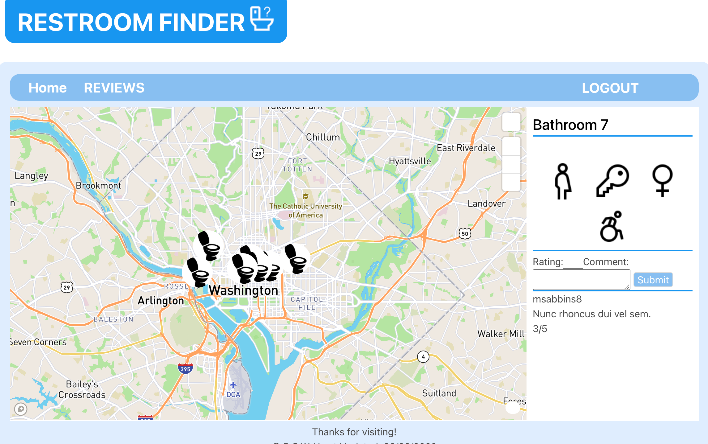

  # Restroom Finder
  Please note: Click events do not render markers in excat location due to map distortion. We plan to fix this int he future as part of a longer term effort to improve and expand the use of this website.

  [](https://opensource.org/licenses/MIT)

  # Table of Contents
  * [Project Description](#description)
  * [Installation](#installation)
  * [Usage](#usage)
  * [Licensing](#license)
  * [Questions](#questions)
  
  <a name="description"></a>
  ## Description
  An MVC app that uses sequelize, express.js, handlebars.js, and  Mapbox GL JS to organize, store, and render crowd-sourced, location-based data to and from a map.
  Deployed: https://restroom-finder.herokuapp.com/

  <a name="install"></a>
  ## Installation
  Clone the repo. cd into the folder and run the command 'npm i'. Then load the server using 'node server.js'. Open the page at port on the server.js. Otherwise, create an account on the deployed site.

  <a name="usage"></a>
  ## Usage
  Create an account and login. Click on map markers to get bathroom information and reviews. Right-click on the map to create a new restroom location. Go to reviews in the navigation bar to see the reviews you have posted.

```
User story:
As a user, I want to be able to locate restrooms and add them to a map
database based on my impression and the facilities offered.

```

```
Given I sam searching for good restrooms near me
When I log into the app
THEN user authentication will occur and redirect to login if the inputs are not correct
When I log in with the correct user inputs
THEN I am able to add markers with reviews and information about the bathroom
When I open the app, I am able to see the map markers with basic review information on the map
When I click on the marker, THEN the restroom information with reviews will pop up in a sidebar to the right
When I add a review, I can add text and give a number rating for a particular restroom
As a user, I can leave multiple reviews and markers and
I can see that each bathroom can have multiple reviews
```

Here is how the app looks: 
  <a name="license"></a>
  ## Licensing
  This app is licensed under MIT. For more information, click on the badge link above.

  <a name="questions"></a>
  ## Questions
  You can find more of my work at [rheam97](https://github.com/rheam97), [yoowook1207](https://github.com/yoowook1207), and [Olopez92084](https://github.com/Olopez92084) on GitHub and contact me with any questions
  at rheam97@gmail.com.


